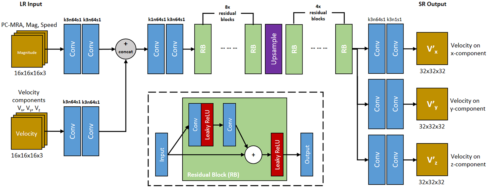
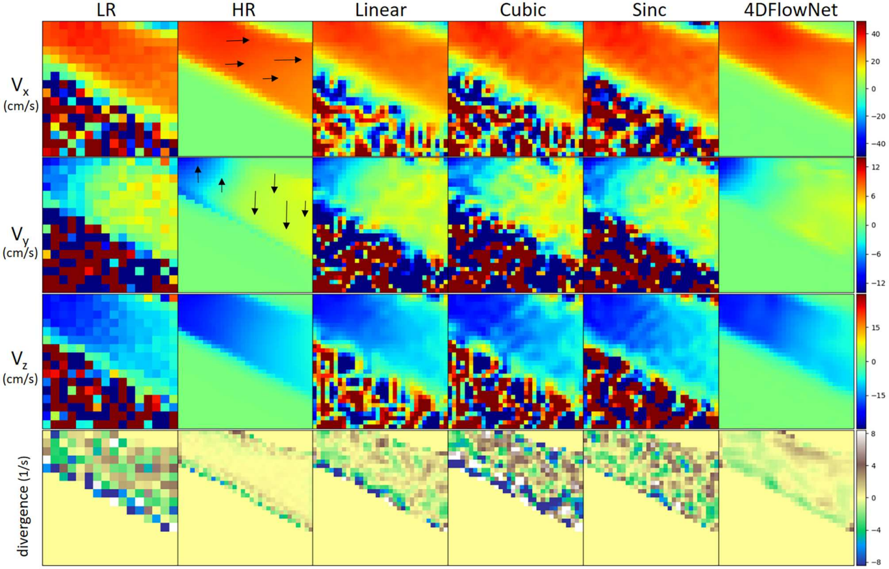
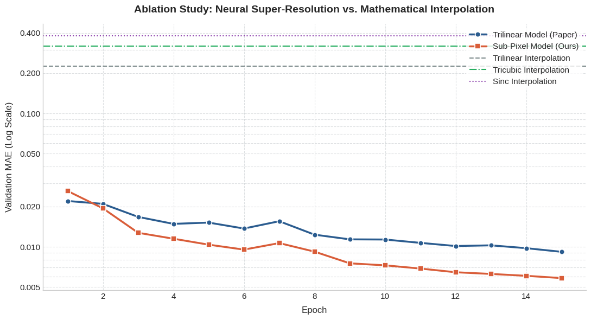
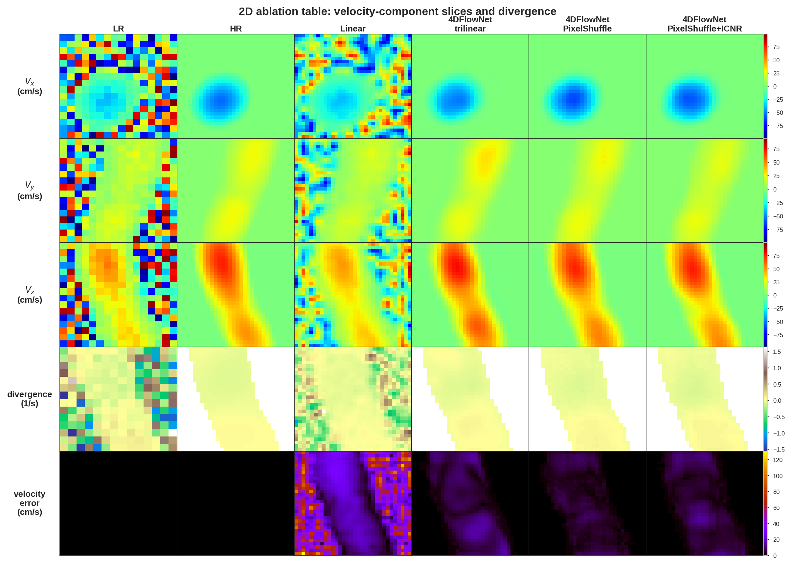

## 4DFlowNet: Paper Breakdown

This post analyzes the 4DFlowNet (2020) paper and presents a small implementation of the paper. 

### Introduction

The goal of this paper is to improve the 4D flow MRI resolution. 4D Flow MRI measures both the velocity and direction over time of moving blood but is subject to noise and low resolution. 4D Flow MRI scans from real patients are expensive which moved the authors to sample realistic low-grade 16x16x16 MRI patches from a  high-quality simulation of the **thoracic aorta** using computational fluid dynamics (CFD). These simulated scanes were upscaled with an image super resolution network that was adapted to 4D flow MRI velocity field representations. The 4D FlowNet trained on simulated data and demonstrated flow rate measurements giving an error of 1.1–3.8% in real volunteer data.

Fun Fact: They used [blender](https://www.blender.org/) to modify the 3D models and create more datasamples.

### Methodolgy

**The Network architecture** is based on a the generator of the super-resolution residual network (ResNet) paper [[2]](https://arxiv.org/abs/1609.04802). The input has one path for the raw noisy velocity maps (16^3) and one that accepts calculated context: Magnitude, Velocities and PC-MRA (=Mag*Speed). Both of them pass through two convolutional maps and are then concatenated, after which they are passed through 8 residual blocks (RB). Each RB consist of two conv layer with a nonlinear layer inbetween and a skip-connection after which another Leaky ReLU is used. After the 8 RB-layers we have 64 sematincally rich feature maps that are upsampled using a simple bilinear resize, after which the features pass through 4 more RBs and three two-layer convolutional heads, for each xyz component,  that redcude the 64 channels back into one channel of size 32^3 now.

**The loss function** consist of a simple mean-squared error (MSE) loss, compares the upsampled velocity components with their ground-truth, added with a velocity gradient (VG) term. While the MSE loss is used to vector maginude error it can lead to blurry images by missing high-frequency spatial velocity shifts, which leads to poor performance close to the vessel walls. The VG loss counter-acts that by rewarding accurate directional derivatives between adjacent velocity vectors. 
$$L_{total} = l_{MSE} + 10^{-3} \cdot l_{VG}$$

**Generating accurate 4D MRI images** needed much more than just down-sampling the mesh from a perfect CFD simulation. In order to model the *Rayleigh noise* that MRI images are subject to, the researchers added noise in the frequency domain using fast fourier transform. Specifically, they did that by calculating the complex numbers from the phase and magnitude images, converting the complex numbers into frequency domain (k-space) and truncating the high-frequency information along all three axes. In addition, they added some white noise to the frequencies and converted them back to the spatial domain.

**The Metrics** that were used in the paper are **relative speed error**, which compares the predicted speed with the ground truth, **net flow rate** (mL/s), which is calculate by integrating the velocity vectors passing through a cross section plane and the **divergence Field** which tracks how well the model preserves divergence-free nature of an incompressible fluid. 

### Paper Results

The most predictable results was that on the **synthetic data** 4D FlowNet outperformed traditional mathematical interpolation methods (Linear, Cubic, Sinc). These were struggling especially during low-velocity phases, while 4D FlowNet was not. Finally, upsampling an In-Vivo aorta from a healthy volunteer cleanly isolated the tissue boundaries and was free from stitching artifacts.

The visual breakdown above showcases how the 4D FlowNet outperforms simple upsampling baselines. While the math-based interpolation methods upsample the noise, the super-resolution generator learned how to effectively subtract the noise, improve the quality, and even implicitly model the fluid's divergence properties. 

---

### Personal Impelementation 

TLDR: The experiments compared trilinear and PixelShuffle upscaling layers with ICNR initialization and found better performance on MAE, flow rate accuracy, etc. while worsening the divergence and introducing checkerboard artifacts.  

For the paper recreation, I did not want to learn how CFD simulation works and opted for a simpliefied dataset, although we still preprocessed the patches with the MRI specific Rayleigh noise.

**The synthetic dataset** was created using a 3D mask of malformed tube and by heuristically generating velocity vectors inside of it. The border tissue of the blood vessel (mask) with a mid-section narrowing, sampled from the gaussian, is the base of the MRI patches. After picking the general direction of the blood flow, we sample a line close to the center with the peak velocity, while bloodflow close to the edges becomes slower. We introduce swirl effects that tilt some movement vectors, similair to real fluids.

**The K-Space** is used as described in the paper to introduce MRI specific noies. First we transform the MRI-patch into a complex MRI signal, using fast fourier transform (FFT), whose outer high-frequency is cropped, downsampling the patch from 32³ to 16³. This complex patch is then corruped with a randomized signal-to-noise ratio (SNR) of 14-17 dB, which is exactly what produces the MRI-specific Rayleigh-distributed noise, once the patches are transformed back into the spatial domain.

synthetic img

**The experiments** I chose to do were upsampling 3D synthetic MRI patches and comparing different upsampling methods.  picked up the PixelShuffle [[3]](https://arxiv.org/abs/1707.02937) that was mentioned in the *Discussion*.

The authors mentioned in the *Discussion* they knew that PixelShuffle [[3]](https://arxiv.org/abs/1707.02937) could increase the quality of super-resolution networks. Nonetheless,they still chose a trilinear upscaling layer, because state-of-the-art methods like PixelShuffle introduced checkerboards in their experiments[[1]](put it in). While they had tried to use a nearest-neighbor initialization, I intended to use ICNR (Initializer for Convolution Nearest-Neighbor Resize) initialization and modern deep learning methods to decrease checkerboard artifacts for sub-pixel convolution [[4]](https://arxiv.org/pdf/1707.02937).

In order to test, that I performed a small ablation study comparing the 4D FlowNet, as in the paper with trilinear upscaling, and  PixelShuffle upscaling with and without ICNR intialization. The results confirmed the papers concerns and, although MAE, flow_velocities and peak flows improved, the divergence score increased by relative 16-20% and checkeboard artifacts increased 80-120% even with ICNR initialization.

#### How We Solved It
We successfully implemented 3D Sub-Pixel Convolution (`PixelShuffle3d`) by introducing three modern deep learning techniques that didn't exist or weren't standard in 2020:
* **AdamW Weight Decay**: Helps stabilize weights in the expanding upsampling layers.
* **Cosine Annealing Learning Rate Schedule**: Smooths out late-stage convergence.
* **Gradient Clipping (`max_norm=1.0`)**: Capping gradients blocks the high-frequency backprop shocks that cause checkerboard artifacts.

Table with all experiment values.